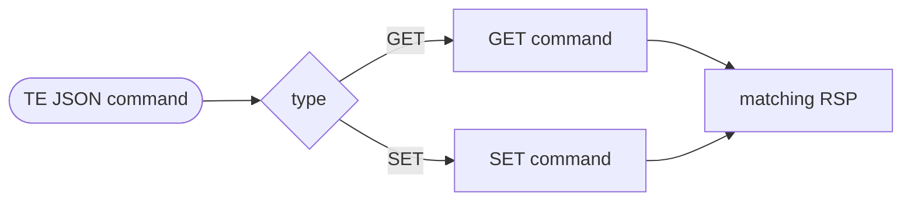
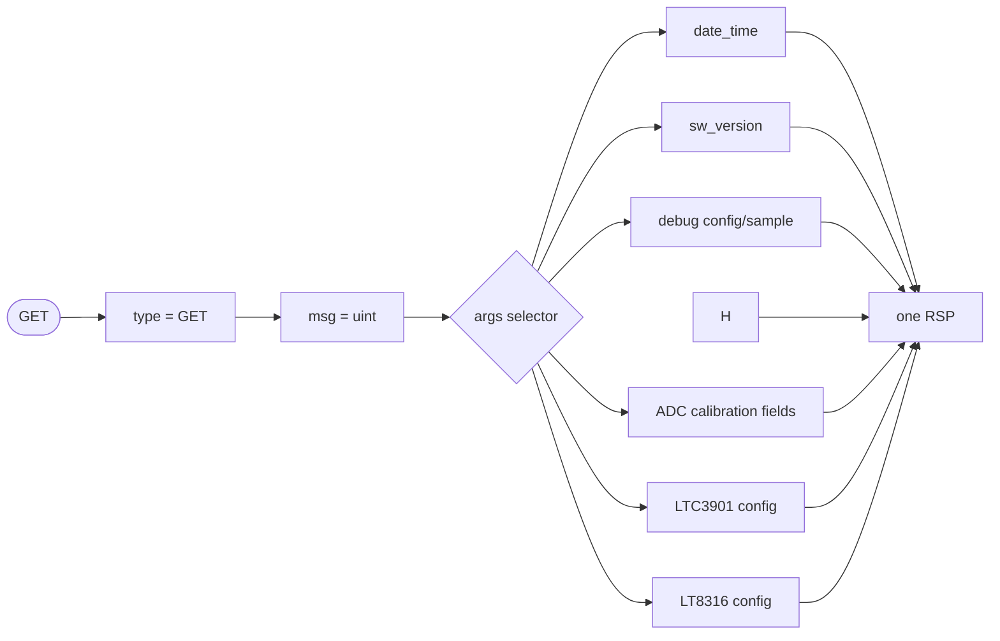
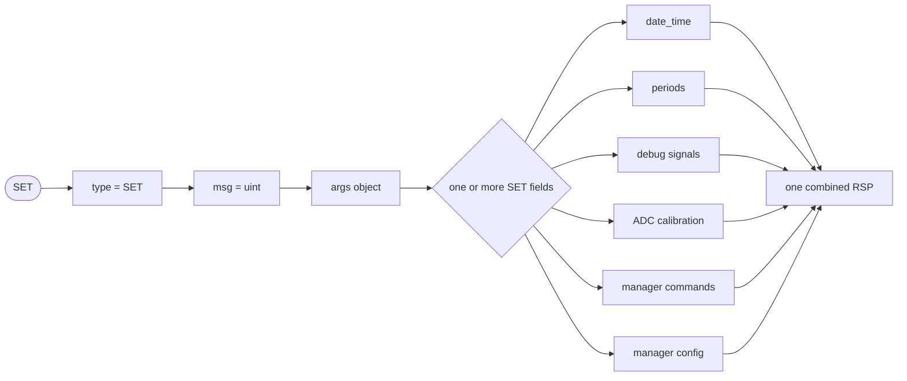
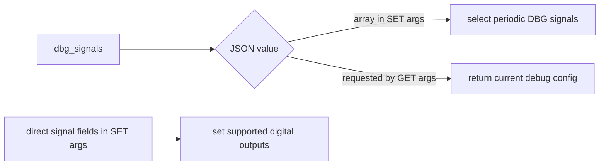
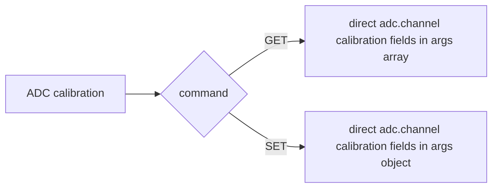
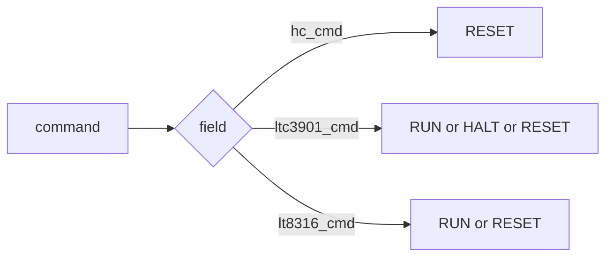
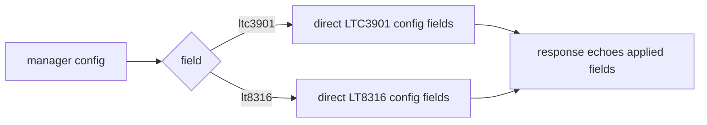
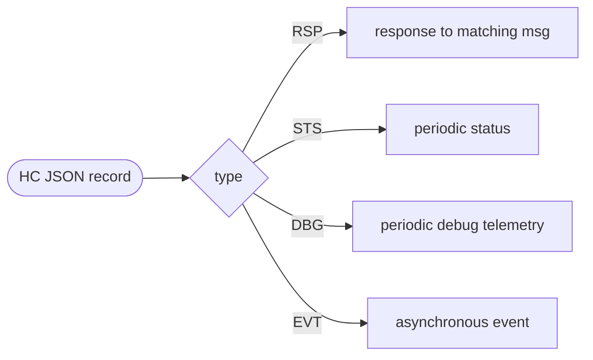

# TE/HC JSON Command Syntax

## Purpose

This document defines the formal syntax for implemented Test Executive (TE) to
Host Controller (HC) JSON commands. It complements
[Command_Reference.md](./Command_Reference.md), which describes command meaning,
responses, errors, and transport behavior.

The diagrams use canonical field order for readability. JSON object member order
is not semantically significant.

## Notation

```text
uint        = non-negative JSON integer
int         = signed JSON integer
bool        = true | false
string      = JSON string
date-time   = string matching "YYYYMMDD HH:MM:SS"
signal-name = string listed in Debug_Signals.md
```

ADC channel selectors:

```text
adc-name    = "vupstream"
            | "ltc3901_vcc"
            | "lt8316_vout"
            | "ltc3901_me"
            | "ltc3901_mf"
            | "lt8316_gate"
            | "temp"
            | "vrefint"
```

ADC debug samples and ADC calibration use direct hierarchical names in the form
`adc.<adc-name>.<signal-field>` or `adc.<adc-name>.<calibration-field>`.

## Top-Level Command



Formal shape:

```text
te-command = get-command | set-command

get-command = {
  "type": "GET",
  "msg": uint,
  "args": get-args
}

set-command = {
  "type": "SET",
  "msg": uint,
  "args": set-args
}
```

`msg` is a TE-supplied correlation value. The HC mirrors it in the matching
`RSP` when the request contains a valid numeric value.

## GET Command



`GET args` is an array of field names. A single request may include more than
one implemented field. Debug telemetry signals are requested directly by their
signal names.

Formal `GET` argument syntax:

```text
get-args = [ get-field *( "," get-field ) ]

get-field = "date_time"
          | "sw_version"
          | "dbg_period_ms"
          | "dbg_signals"
          | signal-name
          | adc-cal-read-field
          | "ltc3901"
          | "lt8316"

adc-cal-read-field = "adc." adc-name "." adc-cal-read-name
adc-cal-read-name = "slope_scaled" | "offset" | "valid"
```

Examples:

```json
{"type":"GET","msg":1,"args":["date_time"]}
{"type":"GET","msg":2,"args":["sw_version"]}
{"type":"GET","msg":4,"args":["adc.vupstream.raw"]}
{"type":"GET","msg":5,"args":["adc.vupstream.slope_scaled","adc.vupstream.offset","adc.vupstream.valid"]}
{"type":"GET","msg":6,"args":["ltc3901"]}
{"type":"GET","msg":7,"args":["lt8316"]}
{"type":"GET","msg":8,"args":["date_time","sw_version","lt8316"]}
```

## SET Command



`SET args` may contain one or more implemented fields. The response contains one
combined `args` object for the fields that were applied.

Formal `SET` argument syntax:

```text
set-args = { set-field *( "," set-field ) }

set-field = set-date-time
          | set-sts-period
          | set-debug-period
          | set-debug-stream
          | set-hc-cmd
          | set-digital-signals
          | set-adc-cal
          | set-ltc3901-cmd
          | set-lt8316-cmd
          | set-ltc3901-cfg
          | set-lt8316-cfg

set-date-time       = "date_time": date-time
set-sts-period      = "sts_period_ms": uint
set-debug-period    = "dbg_period_ms": dbg-period
set-debug-stream    = "dbg_signals": signal-array
set-hc-cmd          = "hc_cmd": hc-command
set-digital-signals = digital-output-name ":" boolean
set-adc-cal         = adc-cal-field
set-ltc3901-cmd     = "ltc3901_cmd": ltc3901-command
set-lt8316-cmd      = "lt8316_cmd": lt8316-command
set-ltc3901-cfg     = ltc3901-config-field
set-lt8316-cfg      = lt8316-config-field

digital-output-name = "ltc3901.pwr_en"
                    | "lt8316.pwr_en"
                    | "led.blue"
                    | "led.red"
                    | "led.green"
```

Period syntax:

```text
dbg-period = 0 | integer in the implemented nonzero debug-period range
```

The current hardware tests enforce `0` or `100..60000` ms for `dbg_period_ms`.
`sts_period_ms = 0` disables periodic `STS`.

Examples:

```json
{"type":"SET","msg":10,"args":{"date_time":"20260501 10:30:00"}}
{"type":"SET","msg":11,"args":{"sts_period_ms":1000}}
{"type":"SET","msg":12,"args":{"dbg_period_ms":1000,"dbg_signals":["adc.vupstream.raw"]}}
{"type":"SET","msg":13,"args":{"ltc3901_cmd":"RUN","lt8316_cmd":"RUN"}}
```

## Debug Signal Arguments



Formal syntax:

```text
signal-array = [ signal-name *( "," signal-name ) ]

digital-output-field = digital-output-name ":" bool

digital-output-name = "ltc3901.pwr_en"
                    | "lt8316.pwr_en"
                    | "led.blue"
                    | "led.red"
                    | "led.green"
```

All valid debug signal names are maintained in
[Debug_Signals.md](./Debug_Signals.md).

Examples:

```json
{"type":"GET","msg":20,"args":["dbg_period_ms"]}
{"type":"GET","msg":21,"args":["adc.vupstream.raw","pwm.me.freq_hz"]}
{"type":"SET","msg":22,"args":{"led.blue":true,"led.red":false}}
```

## ADC Calibration Arguments



Formal syntax:

```text
adc-cal-field = adc-cal-slope | adc-cal-offset | adc-cal-valid

adc-cal-slope = "adc." adc-name ".slope_scaled": int
adc-cal-offset = "adc." adc-name ".offset": int
adc-cal-valid = "adc." adc-name ".valid": bool
```

`SET` ADC calibration updates may include one or more calibration fields for one
ADC channel. Omitted fields retain their current values. Mixing ADC channels in
one calibration update is invalid.

Examples:

```json
{"type":"GET","msg":30,"args":["adc.vupstream.slope_scaled","adc.vupstream.offset","adc.vupstream.valid"]}
{"type":"SET","msg":31,"args":{"adc.vupstream.slope_scaled":2500,"adc.vupstream.offset":-100,"adc.vupstream.valid":true}}
```

## Manager Command Arguments



Formal syntax:

```text
hc-command      = "RESET"
ltc3901-command = "RUN" | "HALT" | "RESET"
lt8316-command  = "RUN" | "RESET"
```

Examples:

```json
{"type":"SET","msg":40,"args":{"ltc3901_cmd":"RUN"}}
{"type":"SET","msg":41,"args":{"lt8316_cmd":"RESET"}}
{"type":"SET","msg":42,"args":{"hc_cmd":"RESET"}}
```

`hc_cmd:"RESET"` is a terminal host-controller action and must be sent as a
standalone `SET` command.

## Manager Configuration Arguments



`GET` uses field names in the `args` array:

```text
get-ltc3901-cfg = "ltc3901"
get-lt8316-cfg  = "lt8316"
```

`SET` accepts one or more implemented direct numeric fields:

```text
ltc3901-config-field = "ltc3901.isupply_ma_max": int
                     | "ltc3901.vupstream_mv_min": int
                     | "ltc3901.ltc3901_vcc_mv_min": int
                     | "ltc3901.power_up_timeout_ms": uint
                     | "ltc3901.power_retry_delay_ms": uint
                     | "ltc3901.power_fault_max": uint
                     | "ltc3901.sync_on_delay_ms": uint
                     | "ltc3901.sync_hold_on_time_ms": uint
                     | "ltc3901.sync_hold_off_time_ms": uint
                     | "ltc3901.sync_stabilization_time_ms": uint
                     | "ltc3901.sync_fault_delay_ms": uint

lt8316-config-field = "lt8316.power_retry_delay_ms": uint
                    | "lt8316.power_fault_max": uint
                    | "lt8316.power_on_stabilization_time_ms": uint
```

Examples:

```json
{"type":"GET","msg":50,"args":["ltc3901"]}
{"type":"GET","msg":51,"args":["lt8316"]}
{"type":"SET","msg":52,"args":{"ltc3901.isupply_ma_max":75,"ltc3901.power_up_timeout_ms":2500}}
{"type":"SET","msg":53,"args":{"lt8316.power_retry_delay_ms":1500,"lt8316.power_fault_max":4}}
```

## HC-Originated Records

The following records are emitted by the HC. They are not TE commands, but they
are part of the observable command/response channel.



Formal top-level shapes:

```text
rsp-record = {
  "type": "RSP",
  "hc": uint,
  [ "msg": uint, ]
  "ts": date-time,
  ( "args": object | "error": error-object )
}

sts-record = {
  "type": "STS",
  "hc_id": uint,
  "ts": date-time,
  "beam_on": bool,
  "duts": object
}

dbg-record = {
  "type": "DBG",
  "hc_id": uint,
  "ts": date-time,
  "signals": object
}

evt-record = {
  "type": "EVT",
  "hc": uint,
  "ts": date-time,
  "args": { "msg": string }
}
```

## Maintenance Notes

- Update this document whenever a command-visible `args` field is added,
  removed, or changes type.
- Keep `Command_Reference.md`, `JSON_Tests.md`, `Test/hw_test_cases.json`, and
  this document synchronized.
- Keep debug signal names in `Debug_Signals.md`; this document references that
  registry rather than duplicating the full signal list.
