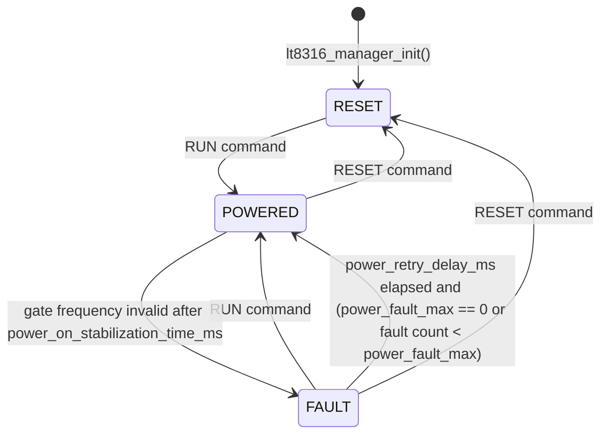

# DUT Manager State Charts

This document captures the implemented DUT manager state charts for the LTC3901 and LT8316 devices.

These charts describe the application manager logic in:

- `App/ltc3901_manager.c`
- `App/lt8316_manager.c`

The user-facing protocol reports these manager state names in the periodic `STS` message under `duts.<device>.state`.

## LTC3901 Manager

```mermaid
stateDiagram-v2
    [*] --> RESET: ltc3901_manager_init()

    RESET --> POWER_PATH: RUN command
    HALT --> POWER_PATH: RUN command
    POWER_PATH --> HALT: HALT command
    POWER_PATH --> RESET: RESET command
    RESET --> HALT: HALT command
    HALT --> RESET: RESET command

    state "Power Path" as POWER_PATH {
        [*] --> POWER_UP

        POWER_UP --> POWER_FAULT: Isupply >= isupply_ma_max
        POWER_UP --> POWER_FAULT: power_up_timeout_ms elapsed
        POWER_UP --> POWERED: VUpstream and VCC valid; Isupply below max

        POWER_FAULT --> POWER_UP: power_retry_delay_ms elapsed and (power_fault_max == 0 or fault count < power_fault_max)

        state "Powered / Common Power Supervision" as POWERED_REGION {
            [*] --> POWERED

            POWERED --> SYNC_REGION: sync_on_delay_ms elapsed

            state "Sync Cycling" as SYNC_REGION {
                [*] --> POWERED_SYNC_ON

                POWERED_SYNC_ON --> POWERED_SYNC_FAULT: ME missing after sync_stabilization_time_ms
                POWERED_SYNC_ON --> POWERED_SYNC_FAULT: MF missing after sync_stabilization_time_ms
                POWERED_SYNC_ON --> POWERED_SYNC_OFF: sync_hold_on_time_ms elapsed

                POWERED_SYNC_OFF --> POWERED_SYNC_ON: sync_hold_off_time_ms elapsed

                POWERED_SYNC_FAULT --> POWERED_SYNC_ON: sync_fault_delay_ms elapsed
            }
        }

        POWERED --> POWER_FAULT: Isupply high or VUpstream/VCC low
        SYNC_REGION --> POWER_FAULT: Isupply high or VUpstream/VCC low
    }
```

This is a hierarchical readability view of the implemented flat state machine. In the C implementation, command handling is performed before the state-specific logic, and common power-fault checks are duplicated in the powered and sync states rather than implemented as true parent-state behavior.

### LTC3901 State Notes

| State | Output intent / behavior |
|---|---|
| `RESET` | LTC3901 power disabled, SDRA/SDRB disabled, power and sync fault counters cleared. |
| `HALT` | LTC3901 power disabled, SDRA/SDRB disabled, fault counters preserved. |
| `POWER_UP` | LTC3901 power enabled, SDRA/SDRB disabled, startup voltage/current checks active. |
| `POWER_FAULT` | LTC3901 power disabled, SDRA/SDRB disabled, power fault count incremented on entry. |
| `POWERED` | LTC3901 power enabled, SDRA/SDRB disabled, waiting before sync enable. |
| `POWERED_SYNC_ON` | LTC3901 power enabled, SDRA/SDRB enabled, ME/MF activity checks active after stabilization. |
| `POWERED_SYNC_OFF` | LTC3901 power enabled, SDRA/SDRB disabled during the sync off interval. |
| `POWERED_SYNC_FAULT` | LTC3901 power enabled, SDRA/SDRB disabled, sync fault count incremented on entry. |

Manager command priority is handled before state-specific processing. A `RUN`, `HALT`, or `RESET` command can therefore interrupt most active states and force the corresponding transition shown above.

For LTC3901 power retries, `power_fault_max = 0` disables the retry-count limit and allows retries indefinitely after each `power_retry_delay_ms` interval.

## LT8316 Manager

### LT8316 State Notes

| State | Output intent / behavior |
|---|---|
| `RESET` | HV power disabled, power fault counter cleared. |
| `POWERED` | HV power enabled, gate activity monitored after the stabilization delay. |
| `FAULT` | HV power disabled, power fault count incremented on entry. |

For LT8316 power retries, `power_fault_max = 0` disables the retry-count limit and allows retries indefinitely after each `power_retry_delay_ms` interval.

Manager command priority is handled before state-specific processing. A `RUN` command requests `POWERED`; a `RESET` command requests `RESET`.
